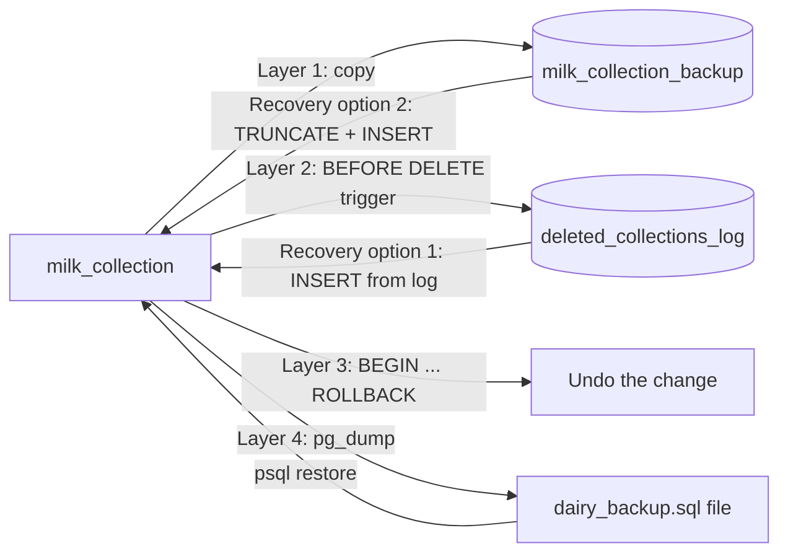

# Architecture: Four Layers of Backup and Recovery

```mermaid
flowchart LR
    A[milk_collection] -->|Layer 1: copy| B[(milk_collection_backup)]
    A -->|Layer 2: BEFORE DELETE trigger| C[(deleted_collections_log)]
    A -->|Layer 3: BEGIN ... ROLLBACK| D[Undo the change]
    A -->|Layer 4: pg_dump| E[dairy_backup.sql file]
    C -->|Recovery option 1: INSERT from log| A
    B -->|Recovery option 2: TRUNCATE + INSERT| A
    E -->|psql restore| A
```
